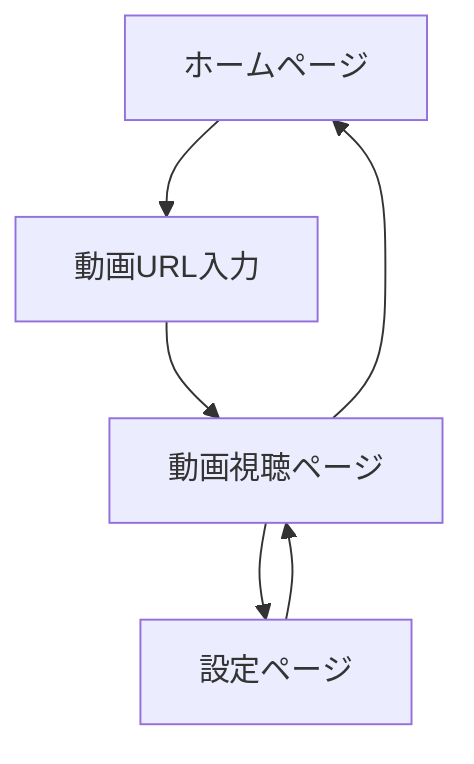

# YouTube トランスクリプト翻訳アプリケーション - プロダクト要件書

## 1. Product Overview
YouTube動画のトランスクリプトをリアルタイムで翻訳し、動画視聴体験を向上させるWebアプリケーション。左側に動画プレーヤー、右側に翻訳されたトランスクリプトを表示し、言語の壁を越えた学習・エンターテイメント体験を提供します。

多言語学習者や海外コンテンツ視聴者をターゲットとし、YouTube動画の理解度向上と効率的な言語学習をサポートします。

## 2. Core Features

### 2.1 User Roles
認証機能は現段階では不要のため、全ユーザーが同等の機能にアクセス可能です。

### 2.2 Feature Module
本アプリケーションは以下の主要ページで構成されます：
1. **ホームページ**: 動画URL入力フォーム、最近の動画履歴表示
2. **動画視聴ページ**: YouTube動画プレーヤー、翻訳されたトランスクリプト表示、タイムスタンプナビゲーション
3. **設定ページ**: 翻訳言語選択、表示設定

### 2.3 Page Details

| Page Name | Module Name | Feature description |
|-----------|-------------|---------------------|
| ホームページ | 動画URL入力フォーム | YouTube動画URLの入力・検証・送信機能 |
| ホームページ | 動画履歴表示 | 最近視聴した動画のサムネイル・タイトル表示、クリックで動画視聴ページへ遷移 |
| 動画視聴ページ | YouTube動画プレーヤー | 埋め込みYouTube動画の再生・一時停止・シーク操作 |
| 動画視聴ページ | トランスクリプト表示 | 動画の音声をテキスト化し、選択言語に翻訳して表示 |
| 動画視聴ページ | タイムスタンプナビゲーション | トランスクリプトの時間ボタンクリックで動画の対応時間にジャンプ |
| 動画視聴ページ | 翻訳処理状態表示 | 初回アクセス時の翻訳処理進行状況をプログレスバーで表示 |
| 設定ページ | 翻訳言語選択 | ユーザーの希望する翻訳先言語を選択・保存 |
| 設定ページ | 表示設定 | フォントサイズ、トランスクリプト表示形式の調整 |

## 3. Core Process

**メインユーザーフロー:**
1. ユーザーがホームページでYouTube動画URLを入力
2. システムが動画情報を取得し、データベースで既存翻訳をチェック
3. 初回アクセスの場合：YouTube APIでトランスクリプト取得→Gemini APIで翻訳→データベース保存
4. 既存データがある場合：データベースから翻訳済みトランスクリプトを読み込み
5. 動画視聴ページで動画とトランスクリプトを同時表示
6. ユーザーがタイムスタンプをクリックして動画の特定時間にジャンプ

## 4. User Interface Design

### 4.1 Design Style
- **プライマリカラー**: #1976D2 (YouTube Blue), **セカンダリカラー**: #F5F5F5 (Light Gray)
- **ボタンスタイル**: 角丸（8px）、マテリアルデザインに準拠したエレベーション効果
- **フォント**: Noto Sans JP（日本語）、Roboto（英語）、サイズ14px-18px
- **レイアウトスタイル**: 2カラムレイアウト（動画：トランスクリプト = 6:4）、カードベースUI
- **アイコンスタイル**: Material Design Icons、再生・一時停止・設定等の直感的なアイコン

### 4.2 Page Design Overview

| Page Name | Module Name | UI Elements |
|-----------|-------------|-------------|
| ホームページ | 動画URL入力フォーム | 中央配置の入力フィールド、プライマリカラーの送信ボタン、バリデーションメッセージ表示エリア |
| ホームページ | 動画履歴表示 | グリッドレイアウトのカード形式、サムネイル画像、タイトル、視聴日時 |
| 動画視聴ページ | YouTube動画プレーヤー | 左側60%幅、16:9アスペクト比維持、レスポンシブ対応 |
| 動画視聴ページ | トランスクリプト表示 | 右側40%幅、スクロール可能エリア、タイムスタンプボタン付きテキスト |
| 動画視聴ページ | 翻訳処理状態表示 | 上部固定のプログレスバー、処理状況テキスト、推定残り時間 |
| 設定ページ | 翻訳言語選択 | ドロップダウンメニュー、言語フラグアイコン、保存ボタン |

### 4.3 Responsiveness
デスクトップファーストのレスポンシブデザインを採用。タブレット（768px以下）では動画とトランスクリプトを縦並び配置、スマートフォン（480px以下）では動画を上部固定、トランスクリプトをスクロール表示に変更。タッチデバイスでのタップ操作を最適化し、タイムスタンプボタンのタップエリアを拡大。