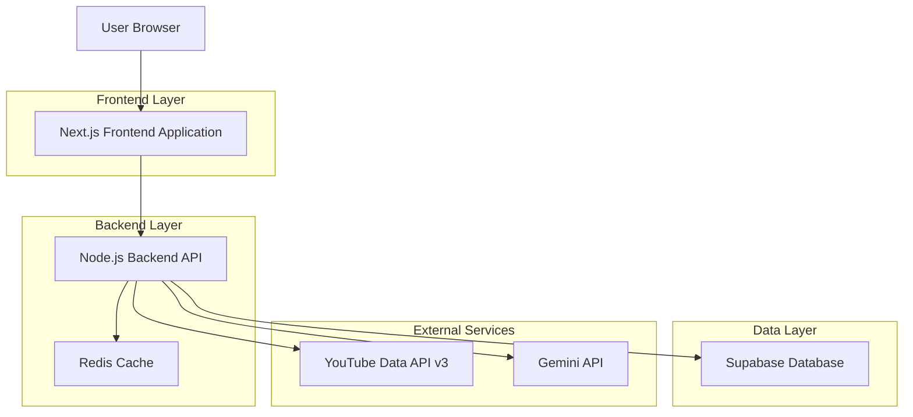
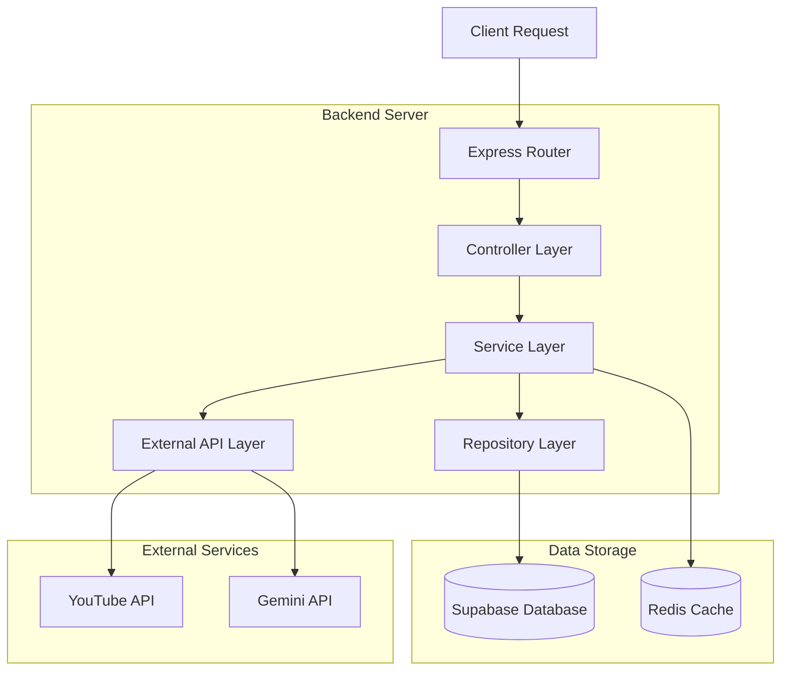
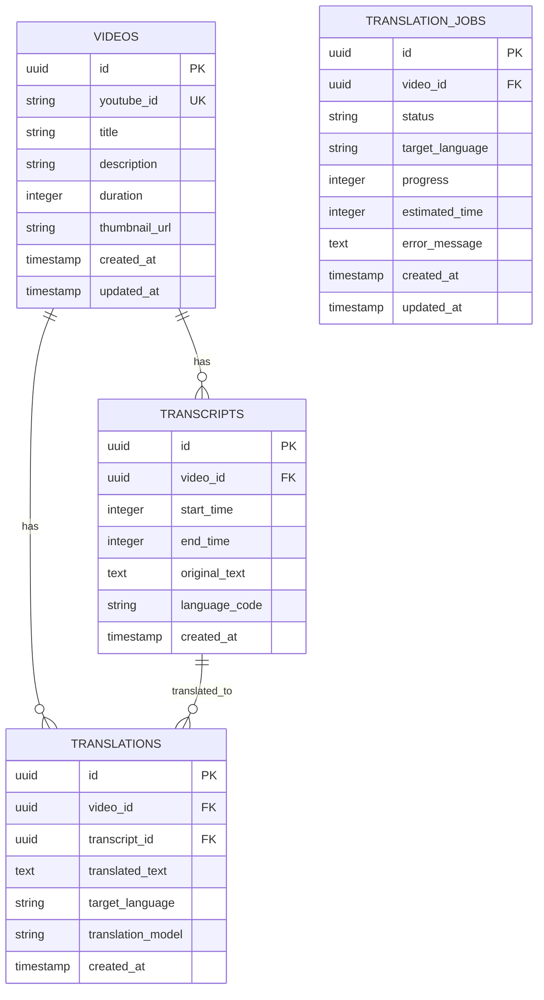

# YouTube トランスクリプト翻訳アプリケーション - 技術アーキテクチャ文書

## 1. Architecture design



## 2. Technology Description

- **Frontend**: Next.js@14 + TypeScript@5 + Tailwind CSS@3 + React Query@5
- **Backend**: Node.js@20 + Express@4 + TypeScript@5
- **Database**: Supabase (PostgreSQL)
- **Cache**: Redis@7
- **External APIs**: YouTube Data API v3, Gemini API

## 3. Route definitions

| Route | Purpose |
|-------|---------|
| / | ホームページ、動画URL入力と履歴表示 |
| /watch/[videoId] | 動画視聴ページ、プレーヤーとトランスクリプト表示 |
| /settings | 設定ページ、翻訳言語と表示設定 |
| /api/videos/analyze | 動画情報取得とトランスクリプト処理API |
| /api/videos/[videoId] | 特定動画のトランスクリプトデータ取得API |
| /api/translate/status/[jobId] | 翻訳処理状況確認API |

## 4. API definitions

### 4.1 Core API

動画分析・トランスクリプト取得
```
POST /api/videos/analyze
```

Request:
| Param Name | Param Type | isRequired | Description |
|------------|------------|------------|-------------|
| videoUrl | string | true | YouTube動画のURL |
| targetLanguage | string | true | 翻訳先言語コード (ja, en, ko, etc.) |

Response:
| Param Name | Param Type | Description |
|------------|------------|-------------|
| videoId | string | YouTube動画ID |
| jobId | string | 翻訳処理ジョブID |
| status | string | 処理状況 (processing, completed, error) |
| estimatedTime | number | 推定処理時間（秒） |

Example:
```json
{
  "videoUrl": "https://www.youtube.com/watch?v=dQw4w9WgXcQ",
  "targetLanguage": "ja"
}
```

動画トランスクリプト取得
```
GET /api/videos/[videoId]
```

Query Parameters:
| Param Name | Param Type | isRequired | Description |
|------------|------------|------------|-------------|
| language | string | false | 翻訳言語コード（デフォルト: ja） |

Response:
| Param Name | Param Type | Description |
|------------|------------|-------------|
| videoId | string | YouTube動画ID |
| title | string | 動画タイトル |
| duration | number | 動画長（秒） |
| transcript | TranscriptSegment[] | トランスクリプトセグメント配列 |

TranscriptSegment Type:
```typescript
interface TranscriptSegment {
  startTime: number; // 開始時間（秒）
  endTime: number;   // 終了時間（秒）
  originalText: string; // 元のテキスト
  translatedText: string; // 翻訳されたテキスト
}
```

翻訳処理状況確認
```
GET /api/translate/status/[jobId]
```

Response:
| Param Name | Param Type | Description |
|------------|------------|-------------|
| jobId | string | 翻訳処理ジョブID |
| status | string | 処理状況 (processing, completed, error) |
| progress | number | 進行率（0-100） |
| estimatedTimeRemaining | number | 推定残り時間（秒） |

## 5. Server architecture diagram



## 6. Data model

### 6.1 Data model definition



### 6.2 Data Definition Language

動画テーブル (videos)
```sql
-- create table
CREATE TABLE videos (
    id UUID PRIMARY KEY DEFAULT gen_random_uuid(),
    youtube_id VARCHAR(20) UNIQUE NOT NULL,
    title TEXT NOT NULL,
    description TEXT,
    duration INTEGER NOT NULL,
    thumbnail_url TEXT,
    created_at TIMESTAMP WITH TIME ZONE DEFAULT NOW(),
    updated_at TIMESTAMP WITH TIME ZONE DEFAULT NOW()
);

-- create index
CREATE INDEX idx_videos_youtube_id ON videos(youtube_id);
CREATE INDEX idx_videos_created_at ON videos(created_at DESC);
```

トランスクリプトテーブル (transcripts)
```sql
-- create table
CREATE TABLE transcripts (
    id UUID PRIMARY KEY DEFAULT gen_random_uuid(),
    video_id UUID NOT NULL,
    start_time INTEGER NOT NULL,
    end_time INTEGER NOT NULL,
    original_text TEXT NOT NULL,
    language_code VARCHAR(10) NOT NULL DEFAULT 'en',
    created_at TIMESTAMP WITH TIME ZONE DEFAULT NOW()
);

-- create index
CREATE INDEX idx_transcripts_video_id ON transcripts(video_id);
CREATE INDEX idx_transcripts_time ON transcripts(video_id, start_time);

-- grant permissions
GRANT SELECT ON transcripts TO anon;
GRANT ALL PRIVILEGES ON transcripts TO authenticated;
```

翻訳テーブル (translations)
```sql
-- create table
CREATE TABLE translations (
    id UUID PRIMARY KEY DEFAULT gen_random_uuid(),
    video_id UUID NOT NULL,
    transcript_id UUID NOT NULL,
    translated_text TEXT NOT NULL,
    target_language VARCHAR(10) NOT NULL,
    translation_model VARCHAR(50) DEFAULT 'gemini-pro',
    created_at TIMESTAMP WITH TIME ZONE DEFAULT NOW()
);

-- create index
CREATE INDEX idx_translations_video_language ON translations(video_id, target_language);
CREATE INDEX idx_translations_transcript_id ON translations(transcript_id);

-- grant permissions
GRANT SELECT ON translations TO anon;
GRANT ALL PRIVILEGES ON translations TO authenticated;
```

翻訳ジョブテーブル (translation_jobs)
```sql
-- create table
CREATE TABLE translation_jobs (
    id UUID PRIMARY KEY DEFAULT gen_random_uuid(),
    video_id UUID NOT NULL,
    status VARCHAR(20) NOT NULL DEFAULT 'pending' CHECK (status IN ('pending', 'processing', 'completed', 'error')),
    target_language VARCHAR(10) NOT NULL,
    progress INTEGER DEFAULT 0 CHECK (progress >= 0 AND progress <= 100),
    estimated_time INTEGER,
    error_message TEXT,
    created_at TIMESTAMP WITH TIME ZONE DEFAULT NOW(),
    updated_at TIMESTAMP WITH TIME ZONE DEFAULT NOW()
);

-- create index
CREATE INDEX idx_translation_jobs_status ON translation_jobs(status);
CREATE INDEX idx_translation_jobs_video_id ON translation_jobs(video_id);

-- grant permissions
GRANT SELECT ON translation_jobs TO anon;
GRANT ALL PRIVILEGES ON translation_jobs TO authenticated;
```

初期データ
```sql
-- サンプル動画データ
INSERT INTO videos (youtube_id, title, description, duration, thumbnail_url)
VALUES 
('dQw4w9WgXcQ', 'Rick Astley - Never Gonna Give You Up', 'Official music video', 212, 'https://img.youtube.com/vi/dQw4w9WgXcQ/maxresdefault.jpg');
```